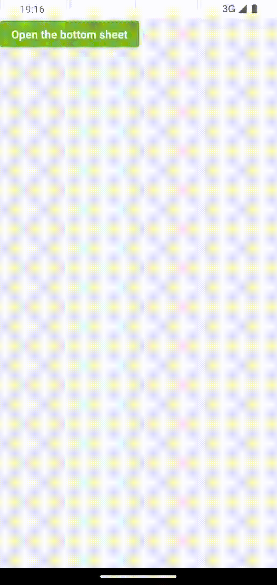

# BasicBottomSheet

<div align="left">
 
</div>

## Adding the dependency
Add jitpack into the repositories

```gradle
dependencyResolutionManagement {
    repositoriesMode.set(RepositoriesMode.FAIL_ON_PROJECT_REPOS)
    repositories {
        google()
        mavenCentral()
        maven { url 'https://jitpack.io' }
    }
}
```

Add the dependency in build.gradle file.
```gradle
implementation 'com.github.mutkuensert:BasicBottomSheet:1.0.1'
```

## Basic usage
Only a boolean is needed to control visibility.
Wherever BasicBottomSheet composable is placed, it will cover full screen when visible argument is true and completely disappear when false.

```kotlin
@Composable
fun Screen() {
  var isSheetVisible by remember { mutableStateOf(false) }

  Button(onClick = { isSheetVisible = true }) {
      Text(text = "Open the bottom sheet")
  }

  BasicBottomSheet(
      visible = isSheetVisible,
      onCloseSheet = { isSheetVisible = false }
  ) {
      Button(
          onClick = {
              //invoke some functions
              isSheetVisible = false //Close the sheet
          }) {
          Text(text = "Some action")
      }
  }
}
```

## Parameters
```kotlin
@Composable
fun BasicBottomSheet(
    onCloseSheet: () -> Unit,
    modifier: Modifier = Modifier,
    visible: Boolean,
    scrimColor: Color = Color.Black.copy(0.4f),
    sheetColor: Color = MaterialTheme.colors.surface,
    closeSheetThreshold: Dp = 150.dp,
    shape: Shape = SheetShape,
    enterTransition: EnterTransition = DefaultEnterTransition,
    exitTransition: ExitTransition = DefaultExitTransition,
    dragHandle: @Composable (() -> Unit)? = { Handle() },
    content: @Composable ColumnScope.() -> Unit
)
```


## Handle
If you don't want the handle, just set it to null.
```kotlin
BasicBottomSheet(
    visible = isVisible,
    dragHandle = null,
    onCloseSheet = onCloseBottomSheet,
){}
```

Or a custom handle can be used, the gesture detection will remain.
```kotlin
BasicBottomSheet(
    visible = isVisible,
    dragHandle = { Icon(imageVector = Icons.Default.ArrowDropDown, contentDescription = null) },
    onCloseSheet = onCloseBottomSheet,
){}
```

 ## License
```xml
Copyright 2024 Mustafa Utku Ensert

Licensed under the Apache License, Version 2.0 (the "License");
you may not use this file except in compliance with the License.
You may obtain a copy of the License at

    http://www.apache.org/licenses/LICENSE-2.0

Unless required by applicable law or agreed to in writing, software
distributed under the License is distributed on an "AS IS" BASIS,
WITHOUT WARRANTIES OR CONDITIONS OF ANY KIND, either express or implied.
See the License for the specific language governing permissions and
limitations under the License.
```
